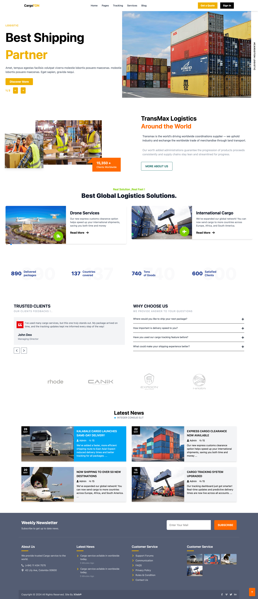

# Cargo Service Website

This is a cargo service web application built using modern web technologies.

## 🚀 Technologies Used

- React.js 19.0
- Tailwind CSS 4.1
- Vite 6.3

## 🛠️ Installation & Running the App

To get started, clone the repository and follow these steps:

```bash
npm install
npm run dev




